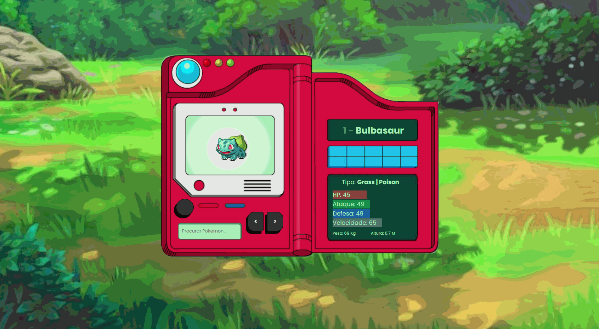

<h1 align="center">
  Pokedex  
</h1>

<p align="center">
  
  
  
</p>

_<p align="center">* Status: Concluído ✅ </p>_

---

<p align="center">
 <a href="#sobre-o-projeto">Sobre</a> •
 <a href="#demonstração">Demonstração</a> • 
 <a href="#tecnologias-utilizadas">Tecnologias</a> • 
 <a href="#funcionalidades">Funcionalidades</a> • 
  <a href="#dependências">Dependências</a> • 
 <a href="#como-executar-o-projeto">Como executar</a> • 
 <a href="#licença">Licença</a> 
</p>

---

## 📑 Sobre o projeto
Pokedex, no mundo da franquia de Pokemon, é um dispositivo que mapeia as informações sobre todos os pokemons existentes. Desse modo, este projeto consiste em uma página web de uma pokedex personalizada e adaptada para a demonstração desses pokemons.
Este projeto tem como base o consumo de uma API Restful, chamada [PokeAPI](https://pokeapi.co/), a qual conta com mais de 900 pokemóns e suas evoluções. Desta API, foram consumidas informações como nome, id, status, tipo, além dos gifs animados de cada Pokemon.
Esta página web teve como principais desafios: consumo de API com async/await; conceitos/efeitos DOM; responsividade com view height/view width e posicionamento de elementos; JS assíncrono.
Como referência de código, foi utilizado o projeto desenvolvido [Manual do Dev](https://github.com/manualdodev/pokedex).

---

## 🎨 Demonstração
<div align="center">
  
</div>

---

## 🚀 Tecnologias utilizadas
As seguintes ferramentas foram utilizadas no desenvolvimento do projeto:
- [**HTML**](https://html.com/)
- [**CSS**](https://www.w3.org/Style/CSS/)
- [**Javascript**](javascript.com)
- [**NodeJS**](https://nodejs.org/en/)
- [**Visual Studio Code**](https://code.visualstudio.com/)

---

## 📌 Funcionalidades
- [x] Fetch API
- [x] Eventos DOM
- [x] Filtro de pesquisa por Nome e ID


---

## 🧲 Dependências
- [x] **[ESLint](https://eslint.org/)**

---

## 🛠️ Como executar o projeto

#### Pré-requisitos

Além de um <u>navegador de internet atualizado</u>, você precisa ter instalado em sua máquina as seguintes ferramentas: [Git](https://git-scm.com), [Node.js](https://nodejs.org/en/) e um editor de código como [VSCode](https://code.visualstudio.com/). Então, siga as instruções abaixo:
``` bash
# Clone este repositório:
$ git clone https://github.com/leonarclo/pokedex.git

# Entre no diretório:
$ cd pokedex

# Visualizaçao:
$ npx liver-server

```
---

## 📝 Licença
Este projeto está licenciado sob a licença MIT. Para mais detalhes, acesse o arquivo [LICENSE.md](https://github.com/leonarclo/pokedex/blob/main/LICENSE).
